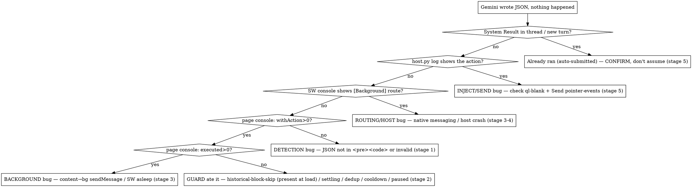

# Debugging the Gemini Chrome Agent

## The one thing to get right

This extension is a **5-stage pipeline**, and every stage is **observable at runtime**. Bugs here are
an *observability* problem, not a code-reading problem. You diagnose by **reading live state at each
stage**, never by inferring it from source.

```
1 DETECT          2 GUARDS            3 ROUTE              4 EXECUTE            5 INJECT + SEND
content.ts    →   settling/dedup/  →  background.ts     →  host.py           →  Quill composer
scans DOM         cooldown/paused     service worker       native messaging     + auto-submit
```

**The two traps — both happened in the incident that motivated this skill:**

1. **Diagnosing from source.** The assistant read `content.ts`, saw a "default to paused" line, and
   declared "it's paused." Live storage had `isAgentPaused: false`. Source says what *could* happen;
   only the running instance says what *did*.
2. **A false green from a synthetic test.** It then injected a *fresh* `<pre><code>` block via CDP, saw
   it execute, and declared "works when active" — while the user's extension was still broken. **A block
   you inject after the page loads bypasses the load-time guards, so it proves nothing about the user's
   condition.** The real "JSON appeared, nothing ran" failure is a **load-time** one: a block already on
   screen when the content script loads is recorded as history and skipped by design (`historical block
   skip`), as is anything in the first 5 s (`settling skip`). Reproduce *that* — JSON present at
   page-load / after a refresh or extension reload — not a clean block injected post-load.

So: **read live state, reproduce the user's actual condition, and walk the pipeline by evidence.** One
cheap thing to rule out early — *did it already run and auto-submit a `System Result:` into the thread?*
That's possible, but in the motivating incident this exact guess was **wrong**; treat it as one branch to
confirm, never the default answer.

## The Four Rules (these are non-negotiable)

These exist because the last assistant that debugged this (without this skill) violated all four:
it read `content.ts`, saw a "default to paused" line, **guessed** "it's paused," **edited** `dedup.ts`
and `content.ts` on that guess, then told the user *"check the chat for a System Result yourself."* The
guess was wrong — live storage actually had `isAgentPaused: false` — so it burned ~30 messages editing
code around a cause that wasn't there, having never read a single runtime surface first.

1. **Read live state — never infer it from source.** Before any hypothesis, read the runtime: extension
   storage, the three console/log surfaces, and the live DOM. Source tells you what *could* happen;
   only the running instance tells you what *did*.
2. **Check the pipeline backward from stage 5.** "Nothing happened" → first prove/disprove that it
   actually *did* happen (a `System Result:` in the thread). Then walk back: host log → SW console →
   page console → DOM shape. Stop at the first stage with no evidence — that is your bug's location.
3. **"Test in the browser" means YOU drive it.** Launch the debug Brave, attach via the `brave-debug`
   MCP (or CDP), inject a real payload, and read console + DOM + host log *yourself*. **Never** open the
   browser and hand it back ("you can test it now" / "check the chat"). If you cannot drive it, say so
   and say why — do not offload the observation. **Reuse one debug Brave and one Gemini tab**
   (`list_pages` → `select_page`); never `new_page` / navigate-to-URL a fresh tab or relaunch Brave while
   one is up (see `knowledge/live-browser-driving.md` → *Tab & window hygiene*).
4. **Do not edit code until evidence confirms the diagnosis.** A guard that *could* swallow a payload
   is not proof that it *did*. Reproduce with evidence first; patch second.

## Diagnostic decision tree (memorize this)



## Evidence surfaces — what proves each stage

| Stage | Surface | What to read |
|-------|---------|--------------|
| 1 Detect | **Page** DevTools console (F12 on Gemini tab) | `[Gemini Agent] Executing action` and `scan complete {withAction, executed}` |
| 2 Guards | Page console + extension storage | `Settling: ignored…` / `dedup skip`; `chrome.storage.local.get('isAgentPaused')` **from the service-worker context** (not the page — `chrome.*` is undefined there) |
| 3 Route | **Service-worker** console (`brave://extensions/` → service worker link) | `[Background]` routing lines |
| 4 Execute | Host log: `tail -f /tmp/gemini_host.log` | `message received {action,id}` then the result |
| 5 Inject+Send | Live **DOM** | `System Result:` text in the thread; `.ql-editor` lost `ql-blank`; Send `pointer-events !== 'none'` |

> **ISOLATED-world trap:** `content.ts` runs in the ISOLATED world. Its `[Gemini Agent]` logs and any
> `_clearDedup`-style helpers are **not visible** to the MCP `list_console_messages` tool (it sees the
> MAIN world). Absence of `[Gemini Agent]` lines there is **not** proof the content script is dead.
> `ERR_BLOCKED_BY_CLIENT` errors are the content script's log-server `fetch` — evidence it IS running.
> To read content-script state, open the page's own DevTools, or `evaluate_script` something both worlds
> can see (storage, DOM, dispatched window events).

## Live-driving quick start

```bash
./scripts/launch-debug-brave.sh          # builds if needed; loads ext from .output/chrome-mv3; CDP :9222
# restart your session so .mcp.json's brave-debug server loads, then: list_pages → navigate_page → evaluate_script
```

Then either drive turn-by-turn with the `brave-debug` MCP, or run the one-shot probe:

```bash
python3 .agents/skills/debugging-gemini-agent/scripts/diagnose.py    # from repo root; prints a per-stage verdict
```

Full CDP/MCP probes (read storage, inject a real payload, read the Send gate, dispatch Alt+Shift+K):
→ **`knowledge/live-browser-driving.md`**

Per-stage failure modes, the guard constants, and the "nothing happened" causes in detail:
→ **`knowledge/pipeline-stages.md`**

Symptom→fix tables for host-not-found, SW sleep, phantom duplicates, injection, no-logs:
→ project **`docs/DEBUGGING.md`** (don't duplicate it; this skill is the *method*, that doc is the *catalog*)

## Rationalization table — stop if you catch yourself here

| Thought | Reality |
|---------|---------|
| "The source defaults to paused, so it's paused." | Source ≠ runtime. Read `chrome.storage.local.get('isAgentPaused')`. It was `false` last time. |
| "Nothing happened, so the pipeline failed." | Maybe — but it may have *succeeded* and auto-sent the result, clearing the composer. Cheap to rule out: check the thread for `System Result:` FIRST, then walk back. Don't assume either way. |
| "I'll open the browser so the user can test." | "Test in the browser" = **you** inject + observe via CDP/MCP. Never hand it back. |
| "A guard could have eaten it — let me fix the guard." | *Could* ≠ *did*. Reproduce with console evidence before editing anything. |
| "No `[Gemini Agent]` logs in MCP, so the content script is dead." | MCP sees MAIN world; the script is ISOLATED. Check storage/DOM instead. |
| "Send button isn't `disabled`, so it's clickable." | Gemini gates Send with `pointer-events:none`, not `disabled`. Check computed `pointer-events`. |
| "I injected text and it shows on screen, so injection worked." | Raw DOM mutation leaves Quill's model empty (`ql-blank` stays) and Send never arms. Use `execCommand('insertText')`. |

## Red flags — you are about to repeat the baseline failure

- You wrote an `Edit`/`StrReplace` before reading any live runtime state.
- Your conclusion contains "probably", "defaults to", "should be" about a *running* instance you could query.
- You're about to tell the user to look at something you have CDP access to read yourself.
- You opened the browser and stopped.

**All of these mean: go read the live evidence first (Rules 1–3).**
